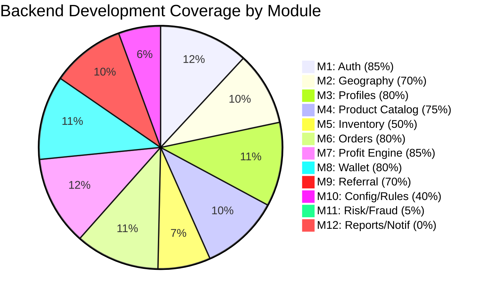

# 🔍 Backend Development Status Analysis
### Schema (`fts_complete_schema.sql`) vs Implemented Backend Code

---

## Summary at a Glance

| # | Schema Module | Tables | Backend Status | Coverage |
|---|--------------|--------|----------------|----------|
| 1 | Identity & Authentication | 7 tables | ✅ **Developed** | ~85% |
| 2 | Geography & District Structure | 6 tables | ✅ **Developed** | ~70% |
| 3 | Role-Specific Profiles | 9 tables | ✅ **Developed** | ~80% |
| 4 | Product & Service Catalog | 7 tables | ✅ **Developed** | ~75% |
| 5 | Inventory & Stock Management | 6 tables | ⚠️ **Partially Developed** | ~50% |
| 6 | Orders & Fulfillment | 10 tables | ✅ **Developed** | ~80% |
| 7 | Profit Distribution Engine | 7 tables | ✅ **Developed** | ~85% |
| 8 | Wallet System | 8 tables | ✅ **Developed** | ~80% |
| 9 | Referral System | 5 tables | ✅ **Developed** | ~70% |
| 10 | System Config & Rule Engine | 7 tables | ⚠️ **Partially Developed** | ~40% |
| 11 | Risk, Fraud & Compliance | 8 tables | ❌ **Not Developed** | ~5% |
| 12 | Reporting & Notifications | 8 tables | ❌ **Not Developed** | ~0% |

> **Overall: Schema-তে 12টি Module আছে — Backend-এ ~8টি Module substantially developed, 2টি partially, এবং 2টি develop হয়নি।**

---

## Detailed Module-wise Analysis

---

### MODULE 1: Identity & Authentication ✅ ~85%

**Schema Tables:** `user_roles`, `users`, `user_sessions`, `user_devices`, `otp_verifications`, `kyc_documents`, `kyc_audit_log`, `login_attempts`

**Implemented in:**
- [authController.js](file:///d:/Download/Abdus%20Shahid/FTS/FTS-2.0-new/Backend/src/controllers/authController.js) — `register`, `login`, `logout`, `changePassword`, `getMe`, `sendOTP`, `verifyOTP`
- [kycController.js](file:///d:/Download/Abdus%20Shahid/FTS/FTS-2.0-new/Backend/src/controllers/kycController.js) — KYC document upload & review
- [deviceController.js](file:///d:/Download/Abdus%20Shahid/FTS/FTS-2.0-new/Backend/src/controllers/deviceController.js) — Device tracking
- [sessionController.js](file:///d:/Download/Abdus%20Shahid/FTS/FTS-2.0-new/Backend/src/controllers/sessionController.js) — Session management
- [loginAttemptsController.js](file:///d:/Download/Abdus%20Shahid/FTS/FTS-2.0-new/Backend/src/controllers/loginAttemptsController.js) — Login attempt logging
- [authMiddleware.js](file:///d:/Download/Abdus%20Shahid/FTS/FTS-2.0-new/Backend/src/middleware/authMiddleware.js) — JWT auth middleware

| Feature | Status |
|---------|--------|
| Registration (phone/email/password) | ✅ Done |
| Login with session + device tracking | ✅ Done |
| Login attempt logging | ✅ Done |
| OTP send/verify | ✅ Done |
| KYC document upload | ✅ Done |
| KYC audit log | ⚠️ Partial (KYC controller exists, audit logging unclear) |
| Admin approval flow | ✅ Done |

---

### MODULE 2: Geography & District Structure ✅ ~70%

**Schema Tables:** `countries`, `states`, `districts`, `cities`, `pincodes`, `district_quota`, `district_coverage_map`

**Implemented in:**
- [geographyController.js](file:///d:/Download/Abdus%20Shahid/FTS/FTS-2.0-new/Backend/src/controllers/geographyController.js) — CRUD for countries, states, districts, cities, pincodes

| Feature | Status |
|---------|--------|
| Countries/States/Districts CRUD | ✅ Done |
| Cities/Pincodes CRUD | ✅ Done |
| District quota management | ⚠️ Schema trigger exists, no dedicated API |
| District coverage map | ❌ No API |

---

### MODULE 3: Role-Specific Profiles ✅ ~80%

**Schema Tables:** `admin_profiles`, `core_body_profiles`, `core_body_installments`, `businessman_profiles`, `businessman_investments`, `retailer_profiles`, `stock_point_profiles`, `customer_profiles`, `upgrade_demotion_log`

**Implemented in:**
- [adminProfileController.js](file:///d:/Download/Abdus%20Shahid/FTS/FTS-2.0-new/Backend/src/controllers/adminProfileController.js)
- [coreBodyProfileController.js](file:///d:/Download/Abdus%20Shahid/FTS/FTS-2.0-new/Backend/src/controllers/coreBodyProfileController.js)
- [businessmanProfileController.js](file:///d:/Download/Abdus%20Shahid/FTS/FTS-2.0-new/Backend/src/controllers/businessmanProfileController.js)
- [dealerProfileController.js](file:///d:/Download/Abdus%20Shahid/FTS/FTS-2.0-new/Backend/src/controllers/dealerProfileController.js)
- [stockPointProfileController.js](file:///d:/Download/Abdus%20Shahid/FTS/FTS-2.0-new/Backend/src/controllers/stockPointProfileController.js)
- [unifiedProfileController.js](file:///d:/Download/Abdus%20Shahid/FTS/FTS-2.0-new/Backend/src/controllers/unifiedProfileController.js) — Unified view across all roles
- [businessmanInvestmentController.js](file:///d:/Download/Abdus%20Shahid/FTS/FTS-2.0-new/Backend/src/controllers/businessmanInvestmentController.js)

| Feature | Status |
|---------|--------|
| Admin profile CRUD | ✅ Done |
| Core Body profile + installments | ✅ Done (auto-created on registration) |
| Businessman profile + investment installments | ✅ Done |
| Dealer profile | ✅ Done |
| Stock Point profile | ✅ Done |
| Customer profile (delivery_addresses, preferences) | ⚠️ Partial — handled via unified controller |
| Upgrade/demotion log | ❌ No API |

---

### MODULE 4: Product & Service Catalog ✅ ~75%

**Schema Tables:** `categories`, `products`, `product_variants`, `product_pricing`, `service_catalog`, `subscription_plans`, `price_history`, `commission_rules`

**Implemented in:**
- [productCatalogController.js](file:///d:/Download/Abdus%20Shahid/FTS/FTS-2.0-new/Backend/src/controllers/productCatalogController.js) — **50KB**, very comprehensive
- [commissionRuleController.js](file:///d:/Download/Abdus%20Shahid/FTS/FTS-2.0-new/Backend/src/controllers/commissionRuleController.js)

| Feature | Status |
|---------|--------|
| Categories CRUD | ✅ Done |
| Products CRUD | ✅ Done |
| Product variants | ✅ Done |
| Product pricing (current/history) | ✅ Done |
| Commission rules | ✅ Done |
| Service catalog | ❌ No API |
| Subscription plans | ❌ No API |
| Price history (immutable log) | ⚠️ Schema trigger exists, no dedicated read API |

---

### MODULE 5: Inventory & Stock Management ⚠️ ~50%

**Schema Tables:** `inventory_ledger`, `stock_allocations`, `inventory_balances`, `stock_requests`, `stock_movement_log`, `minimum_inventory_rules`

**Implemented in:**
- [stockRequestController.js](file:///d:/Download/Abdus%20Shahid/FTS/FTS-2.0-new/Backend/src/controllers/stockRequestController.js) — Stock requests from stock points
- Order controller implicitly uses `inventory_balances` for reservation

| Feature | Status |
|---------|--------|
| Inventory balance check (order flow) | ✅ Done (inline in orderController) |
| Stock requests from stock points | ✅ Done |
| Stock allocations (admin→stock point) | ⚠️ Partial |
| Inventory ledger append-only log | ❌ No dedicated API |
| Stock movement log | ❌ No API |
| Minimum inventory rules & alerts | ❌ No API |

---

### MODULE 6: Orders & Fulfillment ✅ ~80%

**Schema Tables:** `orders`, `order_items`, `order_status_log`, `fulfillment_assignments`, `fulfillment_rule_log`, `delivery_tracking`, `return_requests`, `return_status_log`, `complaints`, `order_sla_log`

**Implemented in:**
- [orderController.js](file:///d:/Download/Abdus%20Shahid/FTS/FTS-2.0-new/Backend/src/controllers/orderController.js) — B2B + B2C order creation, order listing, order details
- [fulfillmentController.js](file:///d:/Download/Abdus%20Shahid/FTS/FTS-2.0-new/Backend/src/controllers/fulfillmentController.js) — Assignment, status updates (accepted/dispatched/delivered), SLA tracking
- [returnComplaintController.js](file:///d:/Download/Abdus%20Shahid/FTS/FTS-2.0-new/Backend/src/controllers/returnComplaintController.js) — Returns + complaints
- [cartController.js](file:///d:/Download/Abdus%20Shahid/FTS/FTS-2.0-new/Backend/src/controllers/cartController.js) — Shopping cart

| Feature | Status |
|---------|--------|
| B2B order creation (wallet payment + PIN) | ✅ Done |
| B2C order creation (auto stock point assignment) | ✅ Done |
| Order status tracking log | ✅ Done |
| Fulfillment assignment (manual + auto) | ✅ Done |
| SLA tracking + breach penalty | ✅ Done |
| Delivery tracking (carrier/tracking no.) | ✅ Done |
| Return requests | ✅ Done |
| Complaints | ✅ Done |
| Fulfillment rule log | ❌ Not logged |
| Return status log | ⚠️ Partial |

---

### MODULE 7: Profit Distribution Engine ✅ ~85%

**Schema Tables:** `profit_rules`, `profit_rule_history`, `profit_distribution_log`, `distribution_line_items`, `company_pool_log`, `reserve_fund_log`, `trust_fund_log`, `cap_enforcement_log`

**Implemented in:**
- [profitEngineService.js](file:///d:/Download/Abdus%20Shahid/FTS/FTS-2.0-new/Backend/src/services/profitEngineService.js) — Full B2B + B2C profit calculation & distribution
- [walletService.js](file:///d:/Download/Abdus%20Shahid/FTS/FTS-2.0-new/Backend/src/services/walletService.js) — Wallet credit helper
- Wallet controller exposes admin views for profit rules, distributions, fund logs

| Feature | Status |
|---------|--------|
| B2B profit split (FTS 55% / Referral 45%) | ✅ Done |
| B2C profit split (Trust/Admin/Company + Stock Point/Referral) | ✅ Done |
| Trust fund ledger | ✅ Done |
| Reserve fund ledger | ✅ Done |
| Company pool log (Core Body 70% / Reserve 30%) | ✅ Done |
| Distribution line items | ✅ Done |
| Profit rules admin CRUD | ✅ Done |
| Cap enforcement log | ❌ Not implemented (yearly/monthly caps not enforced) |
| Profit rule history (archive on update) | ⚠️ Partial — old rule archived but `profit_rule_history` table not used |

---

### MODULE 8: Wallet System ✅ ~80%

**Schema Tables:** `wallet_types`, `wallets`, `wallet_deposit_requests`, `wallet_transactions`, `withdrawal_requests`, `withdrawal_approvals`, `withdrawal_tds_log`, `processing_fee_log`, `wallet_balance_snapshot`

**Implemented in:**
- [walletController.js](file:///d:/Download/Abdus%20Shahid/FTS/FTS-2.0-new/Backend/src/controllers/walletController.js) — **31KB**, extremely detailed
- [adminWalletController.js](file:///d:/Download/Abdus%20Shahid/FTS/FTS-2.0-new/Backend/src/controllers/adminWalletController.js)

| Feature | Status |
|---------|--------|
| Wallet auto-creation (main on registration) | ✅ Done |
| Multi-wallet view (main/referral/trust/reserve) | ✅ Done |
| Wallet fund addition (admin) | ✅ Done |
| Deposit request (bKash/Bank slip upload) | ✅ Done |
| Withdrawal request + admin approve/reject | ✅ Done |
| Transaction PIN set/verify | ✅ Done |
| Transaction log (paginated) | ✅ Done |
| Admin wallet overview (trust/reserve/pool) | ✅ Done |
| TDS log on withdrawal | ❌ Not implemented |
| Processing fee log | ❌ Not implemented |
| Wallet balance snapshot (daily) | ❌ Not implemented |

---

### MODULE 9: Referral System ✅ ~70%

**Schema Tables:** `referral_links`, `referral_registrations`, `referral_earnings`, `referral_payout_log`, `referral_reversal_log`, `suspicious_referral_log`

**Implemented in:**
- [referralController.js](file:///d:/Download/Abdus%20Shahid/FTS/FTS-2.0-new/Backend/src/controllers/referralController.js) — Stats, list, earnings history + admin views
- Registration flow auto-creates `referral_links` and `referral_registrations`
- Profit engine auto-creates `referral_earnings`

| Feature | Status |
|---------|--------|
| Referral link creation (on registration) | ✅ Done |
| Referral registration tracking | ✅ Done |
| Referral earnings (via profit engine) | ✅ Done |
| User referral stats + list | ✅ Done |
| Admin global referral views | ✅ Done |
| Referral payout log | ❌ Not implemented |
| Referral reversal (on return) | ❌ Not implemented |
| Suspicious referral detection | ❌ Not implemented |

---

### MODULE 10: System Configuration & Rule Engine ⚠️ ~40%

**Schema Tables:** `system_config`, `commission_rules`, `cap_rules`, `bulk_pricing_rules`, `district_quota_config`, `sla_rules`, `minimum_inventory_config`, `fee_config`, `config_change_log`

**Implemented in:**
- [commissionRuleController.js](file:///d:/Download/Abdus%20Shahid/FTS/FTS-2.0-new/Backend/src/controllers/commissionRuleController.js) — Commission rules CRUD
- SLA rules used implicitly in fulfillment (hardcoded 24hr)

| Feature | Status |
|---------|--------|
| Commission rules CRUD | ✅ Done |
| System config (read/update) | ❌ No API |
| Cap rules management | ❌ No API |
| Bulk pricing rules | ❌ No API |
| District quota config | ❌ No API (trigger exists in schema) |
| SLA rules CRUD | ❌ No API (hardcoded values used) |
| Fee config (TDS/processing fees) | ❌ No API |
| Config change log | ❌ Not implemented |

---

### MODULE 11: Risk, Fraud & Compliance ❌ ~5%

**Schema Tables:** `duplicate_detection_log`, `device_fingerprint_log`, `suspicious_transaction_log`, `fraud_case_log`, `audit_log`, `inactive_user_log`, `reactivation_log`, `sla_breach_log`, `core_body_limit_breach_log`

**Implemented in:** Almost nothing in the backend code.

| Feature | Status |
|---------|--------|
| Audit log (generic CRUD audit) | ❌ Not implemented |
| Duplicate detection | ❌ Not implemented |
| Device fingerprint fraud detection | ❌ Not implemented |
| Suspicious transaction flagging | ❌ Not implemented |
| Fraud case management | ❌ Not implemented |
| Inactive user detection | ❌ Not implemented |
| Reactivation flow | ❌ Not implemented |
| SLA breach log | ⚠️ Partial — SLA breach detected in fulfillment but `sla_breach_log` table not written |
| Core body limit breach log | ⚠️ Schema trigger writes to it, no API to read/manage |

---

### MODULE 12: Reporting & Notifications ❌ ~0%

**Schema Tables:** `financial_reports`, `earnings_summary`, `notification_templates`, `notification_queue`, `notification_log`, `email_log`, `sms_log`, `push_notification_log`, `report_snapshots`

**Implemented in:** Not implemented at all.

| Feature | Status |
|---------|--------|
| Financial report generation | ❌ Not implemented |
| Earnings summary (periodic) | ❌ Not implemented |
| Notification templates | ❌ Not implemented |
| Notification queue + dispatch | ❌ Not implemented |
| Email/SMS/Push logging | ❌ Not implemented |
| Report snapshots | ❌ Not implemented |

> [!NOTE]
> `utils/email.js` exists for basic OTP email sending, but the full notification queue system from the schema is not built.

---

## 📊 Visual Summary

---

## Backend File Inventory

### Controllers (26 files)
| File | Size | Related Module |
|------|------|----------------|
| productCatalogController.js | 50KB | M4 |
| walletController.js | 31KB | M7, M8 |
| orderController.js | 16KB | M6 |
| authController.js | 15KB | M1 |
| unifiedProfileController.js | 13KB | M3 |
| fulfillmentController.js | 9KB | M6 |
| coreBodyProfileController.js | 7KB | M3 |
| geographyController.js | 7KB | M2 |
| referralController.js | 6KB | M9 |
| returnComplaintController.js | 5KB | M6 |
| adminController.js | 5KB | M1 |
| cartController.js | 5KB | M6 |
| businessmanProfileController.js | 5KB | M3 |
| kycController.js | 4KB | M1 |
| stockRequestController.js | 4KB | M5 |
| dealerProfileController.js | 4KB | M3 |
| adminProfileController.js | 4KB | M3 |
| stockPointProfileController.js | 4KB | M3 |
| commissionRuleController.js | 3KB | M10 |
| adminWalletController.js | 2KB | M8 |
| deviceController.js | 2KB | M1 |
| businessmanInvestmentController.js | 2KB | M3 |
| loginAttemptsController.js | 2KB | M1 |
| uploadController.js | 2KB | — |
| sessionController.js | 2KB | M1 |
| roleController.js | 1KB | M1 |

### Services (2 files)
| File | Description |
|------|-------------|
| profitEngineService.js (13KB) | Full B2B/B2C profit distribution logic |
| walletService.js (5KB) | Wallet credit/debit helper |

---

## 🔴 সবচেয়ে বড় Gaps (যেগুলো Develop হয়নি)

> [!IMPORTANT]
> ### Immediately Missing:
> 1. **MODULE 11 — Risk, Fraud & Compliance** — কোনো audit log, fraud detection, suspicious activity monitoring নেই
> 2. **MODULE 12 — Reporting & Notifications** — কোনো financial report, notification queue, SMS/email/push system নেই
> 3. **System Config API** — `system_config` table-এ data আছে কিন্তু read/update এর কোনো API নেই
> 4. **Cap Enforcement** — Yearly/monthly earning cap check করা হয় না
> 5. **Inventory Ledger** — Append-only inventory ledger properly maintained হচ্ছে না
> 6. **TDS/Processing Fees** — Withdrawal-এ TDS calculation ও processing fee নেই

> [!WARNING]
> ### Financial Integrity Risks:
> - `cap_enforcement_log` table আছে কিন্তু cap enforce হচ্ছে না — unlimited earnings possible
> - `wallet_balance_snapshot` না থাকায় daily balance reconciliation সম্ভব না
> - `referral_reversal_log` না থাকায় return এর পর referral commission rollback হচ্ছে না
> - `sla_breach_log` table-এ data insert হচ্ছে না যদিও SLA breach detect হচ্ছে

---

## ✅ যেটুকু ভালোভাবে Develop হয়েছে

> [!TIP]
> ### Strong Points:
> 1. **Profit Distribution Engine** — সবচেয়ে mature module; B2B/B2C rules, trust/reserve fund, company pool — সব কাজ করছে
> 2. **Wallet System** — Multi-wallet support, deposit requests, withdrawal with admin approval, PIN verification — all working
> 3. **Order System** — B2B (wallet payment + inventory check) + B2C (auto stock point assignment + SLA) — well implemented
> 4. **Auth System** — Registration with role-based profile creation, login with device/session tracking, OTP — solid
> 5. **Fulfillment** — Stock point assignment, status tracking, SLA breach detection, profit trigger on delivery — complete flow

